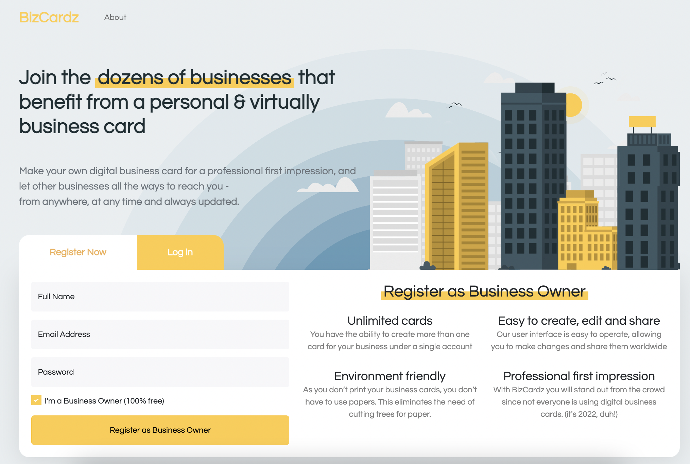

# BizCardz - Client Side
The project includes a server side (NodeJs with MongoDB) and a client side based on React (TypeScript).


## Additional features are:
- CRUD Operations that can be performed on business Cards
- User Authentication with tokens
- Custom API Service

## Installation
*Be sure to download all modules needed for this project*. To do this, write the following code in the terminal:

```
npm i  
```

In addition, a file called `.env` is missing for the security reasons.
You need to add this file and insert the following variables enviorment:

```
REACT_APP_API = "insert your localhost URL"
```

## View Project Live
[click here](https://bizcardz.onrender.com/).


## Screenshots

| Component | Screenshots |
| --- | --- |
| Home Component |  |
| About Component |  |
| Cardz Component |  |
| Add Card Component |  |
| Profile Component |  |


:star2:	Made by Shahaf Seza
